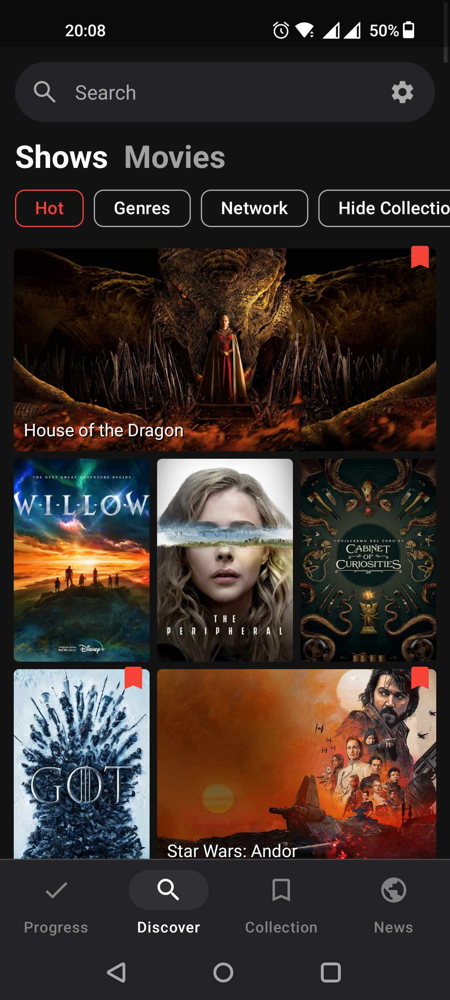
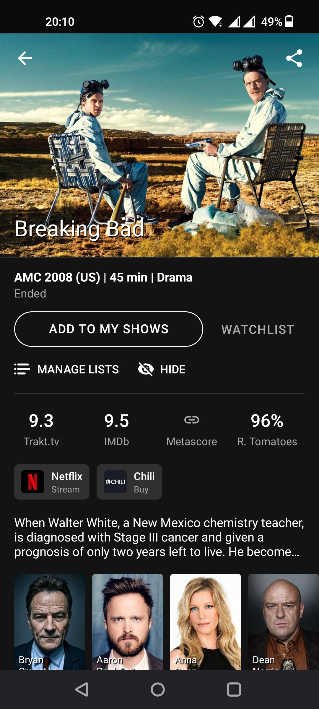
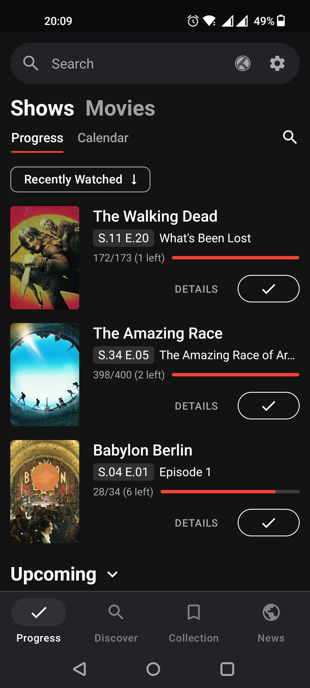
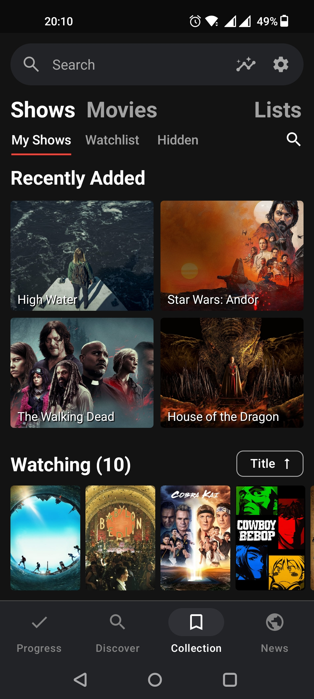

# Showly OSS


Showly 2.0 is modern, slick, open source Android TV Shows Tracker.

This fork gets rid of all proprietary tracking libraries.

<a href="https://github.com/1RandomDev/showly-oss/releases/latest">
  
</a>
<a href="https://apt.izzysoft.de/fdroid/index/apk/com.michaldrabik.showly_oss">
  
</a>

## Screenshots

<div>
   
   
   
   
</div>

## Project Setup

1. Clone repository and open project in the latest version of Android Studio.
2. Create `keystore.properties` file and put it in the `/app` folder.
3. Add following properties into `keystore.properties` file (values are not important at this moment):
```
keyAlias=github
keyPassword=github
storePassword=github
```
4. Add your [Trakt.tv](https://trakt.tv/oauth/applications), [TMDB](https://developers.themoviedb.org/3/), [OMDB](http://www.omdbapi.com) and [Reddit](https://www.reddit.com/prefs/apps) API keys as following properties into your `local.properties` file located in the root directory of the project:
```
traktClientId="your trakt client id"
traktClientSecret="your trakt client secret"
tmdbApiKey="your tmdb api key (v4)"
omdbApiKey="your omdb api key"
redditClientId="your reddit client id"
```
5. Rebuild and start the app.

## Issues & Contributions

Feel free to post problems with the app as Github [Issues](https://github.com/1RandomDev/showly-oss/issues).

Features ideas should be posted as new Github [Discussion](https://github.com/1RandomDev/showly-oss/discussions).

Pull requests are welcome. Remember about leaving a comment in the relevant issue if you are working on something.

### Language Translations

We're always looking for help with translating app into more languages.<br>
If you are interested in helping now or in the future, please visit our CrowdIn project and join:<br>
https://crwd.in/showly-android-app

## FAQ

**1. Can I watch/stream/download shows and movies with Showly app?**

  No, that is not possible. Showly is a progress tracking type of app - not a streaming service.

**2. Show/Episode/Movie I'm looking for seems to be missing. What can I do?**

  Showly uses [Trakt.tv](https://trakt.tv) as its main data source.
  If something is missing please use "Import Show" / "Import Movie" option located at the bottom of Trakt.tv website.
  It's also possible to contact Trakt.tv support about any related issue.
